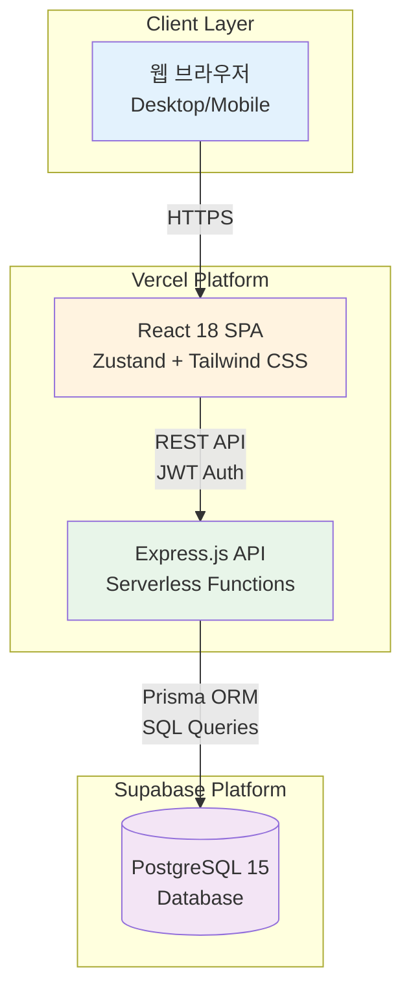
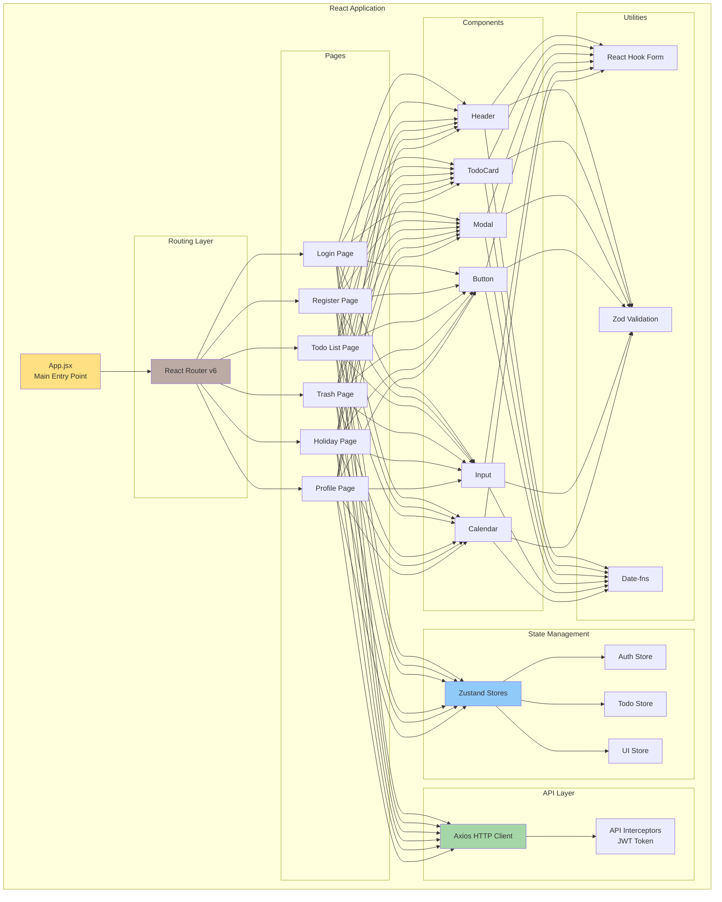
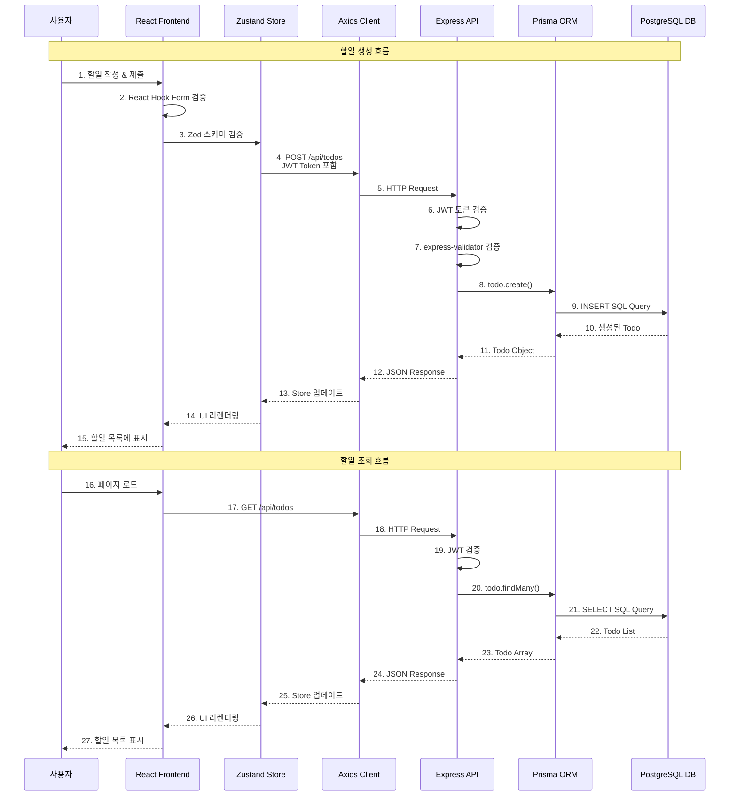
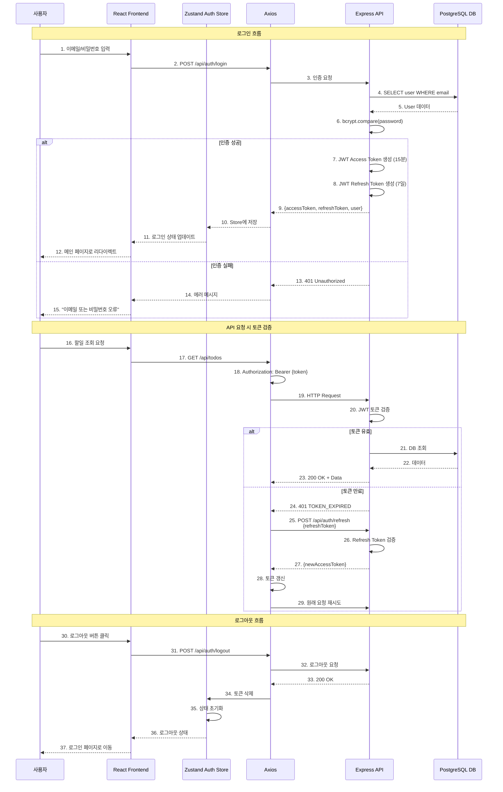
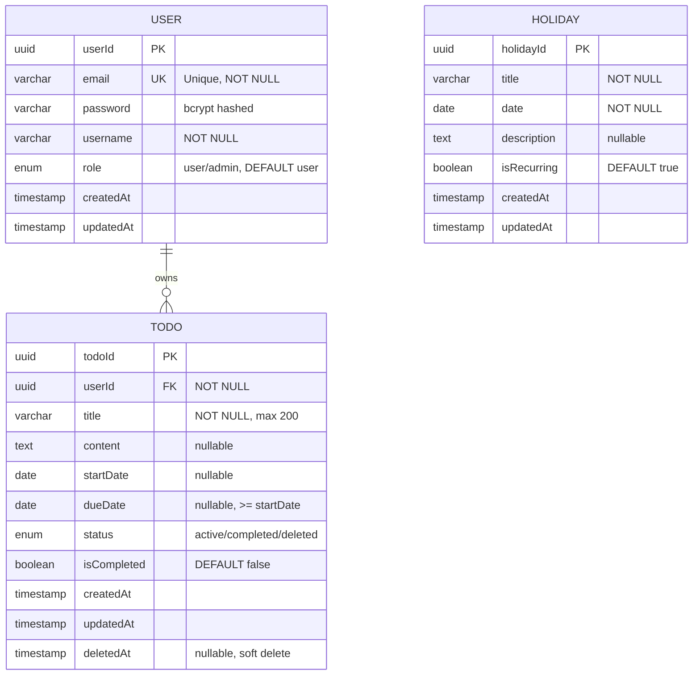
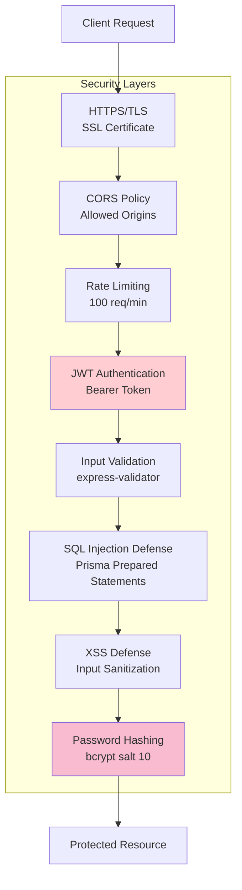
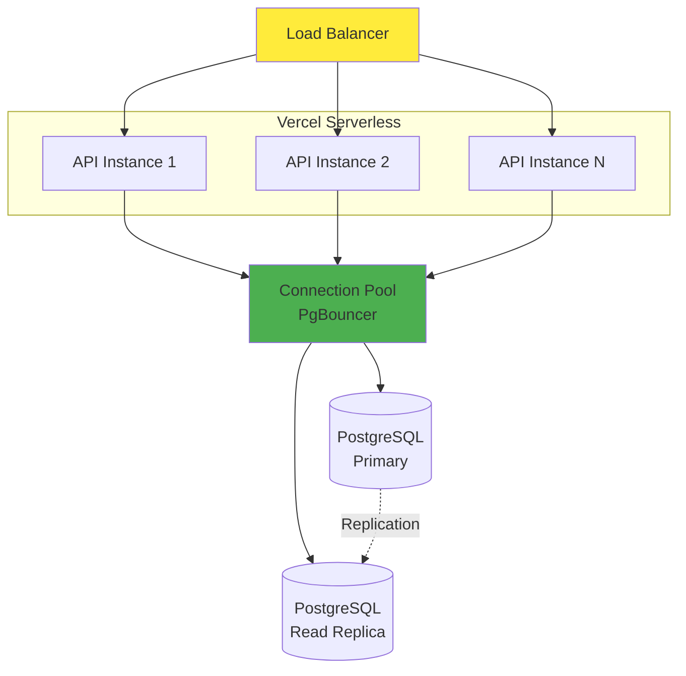

# csh-TodoList 기술 아키텍처

**버전**: 1.0
**작성일**: 2025-11-26
**상태**: 최종
**작성자**: Claude
**참조 문서**:
- [도메인 정의서](./1-domain-definition.md)
- [PRD](./3-prd.md)
- [스타일 가이드](./4-style-guide.md)

---

## 목차

1. [전체 시스템 아키텍처](#1-전체-시스템-아키텍처)
2. [프론트엔드 아키텍처](#2-프론트엔드-아키텍처)
3. [백엔드 아키텍처](#3-백엔드-아키텍처)
4. [데이터 흐름 다이어그램](#4-데이터-흐름-다이어그램)
5. [인증 흐름 다이어그램](#5-인증-흐름-다이어그램)
6. [배포 아키텍처](#6-배포-아키텍처)

---

## 1. 전체 시스템 아키텍처

전체 시스템은 프론트엔드, 백엔드 API, 데이터베이스로 구성된 3-Tier 아키텍처를 따릅니다. 모든 컴포넌트는 Vercel과 Supabase 클라우드 환경에 배포됩니다.



**주요 특징**:
- **클라이언트**: 데스크톱 및 모바일 웹 브라우저 지원
- **프론트엔드**: React 18 기반 SPA, Zustand 상태 관리
- **백엔드**: Express.js 기반 RESTful API, JWT 인증
- **데이터베이스**: PostgreSQL 15, Prisma ORM 사용
- **배포**: Vercel (프론트/백엔드), Supabase (DB)

---

## 2. 프론트엔드 아키텍처

프론트엔드는 컴포넌트 기반 아키텍처로 설계되며, Zustand를 통한 중앙 상태 관리와 React Router를 통한 라우팅을 구현합니다.



**주요 레이어**:
1. **Routing Layer**: React Router v6로 페이지 라우팅 관리
2. **State Management**: Zustand로 전역 상태 관리 (인증, 할일, UI)
3. **Pages**: 주요 화면 컴포넌트 (로그인, 할일 목록, 휴지통 등)
4. **Components**: 재사용 가능한 UI 컴포넌트
5. **API Layer**: Axios 기반 HTTP 통신, JWT 인터셉터
6. **Utilities**: 폼 관리, 유효성 검증, 날짜 처리

**기술 스택**:
- Framework: React 18
- State: Zustand
- Styling: Tailwind CSS
- HTTP: Axios
- Routing: React Router v6
- Form: React Hook Form + Zod

---

## 3. 백엔드 아키텍처

백엔드는 Express.js 기반의 RESTful API 서버로, 미들웨어 체인을 통한 요청 처리와 Prisma ORM을 통한 데이터베이스 접근을 구현합니다.

```mermaid
graph TB
    subgraph "Express.js Server"
        A[Express App]

        subgraph "Middleware Chain"
            B1[Helmet<br/>Security Headers]
            B2[CORS<br/>Cross-Origin]
            B3[Body Parser<br/>JSON/URLencoded]
            B4[Rate Limiter<br/>100 req/min]
            B5[JWT Auth<br/>Token Verification]
            B6[Error Handler<br/>Global Error]
        end

        subgraph "Routes"
            C1[/api/auth<br/>Authentication]
            C2[/api/todos<br/>Todo CRUD]
            C3[/api/trash<br/>Trash Management]
            C4[/api/holidays<br/>Holiday Management]
            C5[/api/users<br/>User Profile]
        end

        subgraph "Controllers"
            D1[Auth Controller]
            D2[Todo Controller]
            D3[Trash Controller]
            D4[Holiday Controller]
            D5[User Controller]
        end

        subgraph "Services"
            E1[Auth Service<br/>JWT, bcrypt]
            E2[Todo Service<br/>Business Logic]
            E3[Holiday Service<br/>Business Logic]
            E4[User Service<br/>Business Logic]
        end

        subgraph "Data Access Layer"
            F[Prisma Client]
            F1[User Model]
            F2[Todo Model]
            F3[Holiday Model]
        end

        subgraph "Validation"
            G[Express Validator]
        end
    end

    H[(PostgreSQL<br/>Supabase)]

    A --> B1 --> B2 --> B3 --> B4
    B4 --> C1 & C2 & C3 & C4 & C5
    C1 & C2 & C3 & C4 & C5 --> B5
    C1 --> D1
    C2 --> D2
    C3 --> D3
    C4 --> D4
    C5 --> D5
    D1 --> E1
    D2 --> E2
    D3 --> E2
    D4 --> E3
    D5 --> E4
    E1 & E2 & E3 & E4 --> F
    F --> F1 & F2 & F3
    F --> H
    D1 & D2 & D3 & D4 & D5 --> G
    B1 & B2 & B3 & B4 & B5 --> B6

    style A fill:#FFE082
    style F fill:#90CAF9
    style H fill:#CE93D8
```

**주요 레이어**:
1. **Middleware Chain**: 보안, CORS, 파싱, Rate Limiting, 인증, 에러 처리
2. **Routes**: RESTful API 엔드포인트 정의
3. **Controllers**: 요청 처리 및 응답 관리
4. **Services**: 비즈니스 로직 구현
5. **Data Access**: Prisma ORM을 통한 DB 접근
6. **Validation**: express-validator를 통한 요청 검증

**보안 계층**:
- Helmet: HTTP 보안 헤더
- CORS: 허용된 Origin만 접근
- Rate Limiter: API 남용 방지
- JWT Auth: 토큰 기반 인증
- bcrypt: 비밀번호 해싱

---

## 4. 데이터 흐름 다이어그램

할일 생성부터 조회까지의 전체 데이터 흐름을 보여줍니다.



**데이터 흐름 단계**:
1. **클라이언트 검증**: React Hook Form + Zod
2. **네트워크 전송**: Axios with JWT
3. **서버 검증**: express-validator
4. **비즈니스 로직**: Service Layer
5. **데이터 접근**: Prisma ORM
6. **데이터베이스**: PostgreSQL
7. **응답 전파**: DB → Prisma → API → Store → UI

---

## 5. 인증 흐름 다이어그램

JWT 기반 인증 시스템의 전체 흐름을 나타냅니다.



**인증 보안 요소**:
- **Access Token**: 15분 만료, HTTP 요청 시 Bearer Token
- **Refresh Token**: 7일 만료, 토큰 갱신 전용
- **비밀번호 해싱**: bcrypt (salt rounds: 10)
- **토큰 저장**: LocalStorage 또는 Cookie (HttpOnly)
- **자동 갱신**: Axios Interceptor에서 토큰 만료 시 자동 갱신

---

## 6. 배포 아키텍처

Vercel과 Supabase를 활용한 클라우드 배포 아키텍처입니다.

```mermaid
graph TB
    subgraph "Client Devices"
        A1[Desktop Browser]
        A2[Mobile Browser]
    end

    subgraph "Vercel Platform"
        B[Vercel CDN<br/>Edge Network]

        subgraph "Frontend Hosting"
            C[React SPA<br/>Static Files]
            C1[HTML/CSS/JS Bundle]
            C2[Assets & Images]
        end

        subgraph "Backend Hosting"
            D[Serverless Functions<br/>Express.js API]
            D1[/api/auth/*]
            D2[/api/todos/*]
            D3[/api/trash/*]
            D4[/api/holidays/*]
        end

        E[Environment Variables<br/>JWT_SECRET, DB_URL]
    end

    subgraph "Supabase Platform"
        F[(PostgreSQL Database)]
        G[Connection Pooling<br/>PgBouncer]
        H[Auto Backup<br/>Daily]
        I[Monitoring<br/>Performance Metrics]
    end

    subgraph "GitHub"
        J[Git Repository]
        K[GitHub Actions<br/>CI/CD Pipeline]
    end

    A1 & A2 -->|HTTPS| B
    B --> C
    C --> C1 & C2
    B --> D
    D --> D1 & D2 & D3 & D4
    D --> E
    D -->|Prisma Client<br/>Connection String| G
    G --> F
    F --> H
    F --> I
    J --> K
    K -->|Auto Deploy| B

    style B fill:#FFE082
    style C fill:#A5D6A7
    style D fill:#90CAF9
    style F fill:#CE93D8
    style K fill:#FFAB91
```

**배포 환경 구성**:

### 6.1 프론트엔드 배포 (Vercel)
- **호스팅**: Vercel Static Site Hosting
- **CDN**: Global Edge Network (자동)
- **빌드**: Vite Build → Static Files
- **도메인**: Vercel 제공 도메인 (*.vercel.app)
- **HTTPS**: 자동 SSL 인증서

### 6.2 백엔드 배포 (Vercel Serverless)
- **호스팅**: Vercel Serverless Functions
- **엔드포인트**: /api/* 경로
- **콜드 스타트**: 최소화 (Connection Pooling)
- **환경 변수**: Vercel Dashboard에서 관리
  - `DATABASE_URL`: Supabase PostgreSQL
  - `JWT_SECRET`: JWT 서명 키
  - `JWT_REFRESH_SECRET`: Refresh Token 키

### 6.3 데이터베이스 (Supabase)
- **DB**: PostgreSQL 15
- **Connection**: Prisma Client + Connection Pooling
- **백업**: 일일 자동 백업
- **모니터링**: Supabase Dashboard
- **보안**: SSL/TLS 연결, IP 화이트리스트 (선택)

### 6.4 CI/CD 파이프라인 (GitHub Actions)
- **트리거**: `main` 브랜치 Push
- **빌드**: ESLint → TypeScript 체크 → Build
- **테스트**: 유닛 테스트 실행 (선택)
- **배포**: Vercel 자동 배포
- **알림**: 슬랙 또는 이메일 (선택)

**배포 흐름**:
1. 개발자가 코드를 GitHub에 Push
2. GitHub Actions가 자동으로 빌드 및 테스트
3. Vercel이 자동으로 배포 감지 및 실행
4. 프론트엔드는 CDN으로, 백엔드는 Serverless로 배포
5. Supabase DB는 Prisma를 통해 연결

---

## 7. 데이터베이스 ERD

데이터베이스의 엔티티 관계를 시각화한 다이어그램입니다.



**엔티티 관계**:
- User와 Todo: 1:N 관계 (한 사용자가 여러 할일 소유)
- Holiday: 독립 엔티티 (모든 사용자 공유)

**주요 제약조건**:
- `User.email`: UNIQUE INDEX
- `Todo.dueDate`: CHECK (dueDate >= startDate)
- `Todo.userId`: FOREIGN KEY → User.userId (ON DELETE CASCADE)

**인덱스 전략**:
- `User`: userId (PK), email (UNIQUE)
- `Todo`: todoId (PK), [userId, status], dueDate, deletedAt
- `Holiday`: holidayId (PK), date

---

## 8. 기술 스택 요약

```mermaid
graph LR
    subgraph "Frontend"
        A1[React 18]
        A2[Zustand]
        A3[Tailwind CSS]
        A4[Axios]
        A5[React Router v6]
        A6[React Hook Form]
        A7[Zod]
        A8[Vite]
    end

    subgraph "Backend"
        B1[Node.js 18+]
        B2[Express.js 4]
        B3[Prisma ORM]
        B4[JWT]
        B5[bcrypt]
        B6[express-validator]
    end

    subgraph "Database"
        C1[PostgreSQL 15]
        C2[Supabase]
    end

    subgraph "Deployment"
        D1[Vercel Frontend]
        D2[Vercel Serverless]
        D3[GitHub]
    end

    A1 --> A2 & A3 & A4 & A5 & A6 & A7 & A8
    B1 --> B2 & B3 & B4 & B5 & B6
    C1 --> C2
    D1 & D2 --> D3

    style A1 fill:#61DAFB
    style B2 fill:#90C53F
    style C1 fill:#336791
    style D1 fill:#000000
```



---

## 9. 비기능 요구사항 아키텍처

### 9.1 보안 아키텍처



### 9.2 성능 최적화

**프론트엔드**:
- 코드 스플리팅 (React.lazy)
- 번들 크기 최소화 (Vite Tree-shaking)
- 이미지 최적화 (WebP, Lazy Loading)
- Memoization (React.memo, useMemo)

**백엔드**:
- 데이터베이스 인덱싱
- Connection Pooling (PgBouncer)
- 쿼리 최적화 (Prisma)
- API Response Caching (선택)

**목표 성능**:
- API 응답 시간: < 1,000ms (95 percentile)
- 페이지 로딩: < 3초 (FCP)
- 동시 사용자: 100명 지원

---

## 10. 확장 가능성 고려사항

### 10.1 수평 확장 (Horizontal Scaling)



**확장 전략**:
- Vercel은 자동으로 Serverless Function 확장
- PostgreSQL Read Replica 추가 (읽기 분산)
- Redis 캐싱 레이어 추가 (2차 개발)
- CDN을 통한 정적 자산 분산

### 10.2 모니터링 및 로깅

**모니터링 도구** (2차 개발):
- Vercel Analytics: 프론트엔드 성능
- Sentry: 에러 트래킹
- Supabase Monitoring: DB 성능
- LogRocket: 사용자 세션 리플레이

---

## 11. 변경 이력

| 버전 | 날짜 | 변경 내용 | 작성자 |
|------|------|----------|--------|
| 1.0 | 2025-11-26 | 초안 작성 | Claude |

---

**문서 종료**
