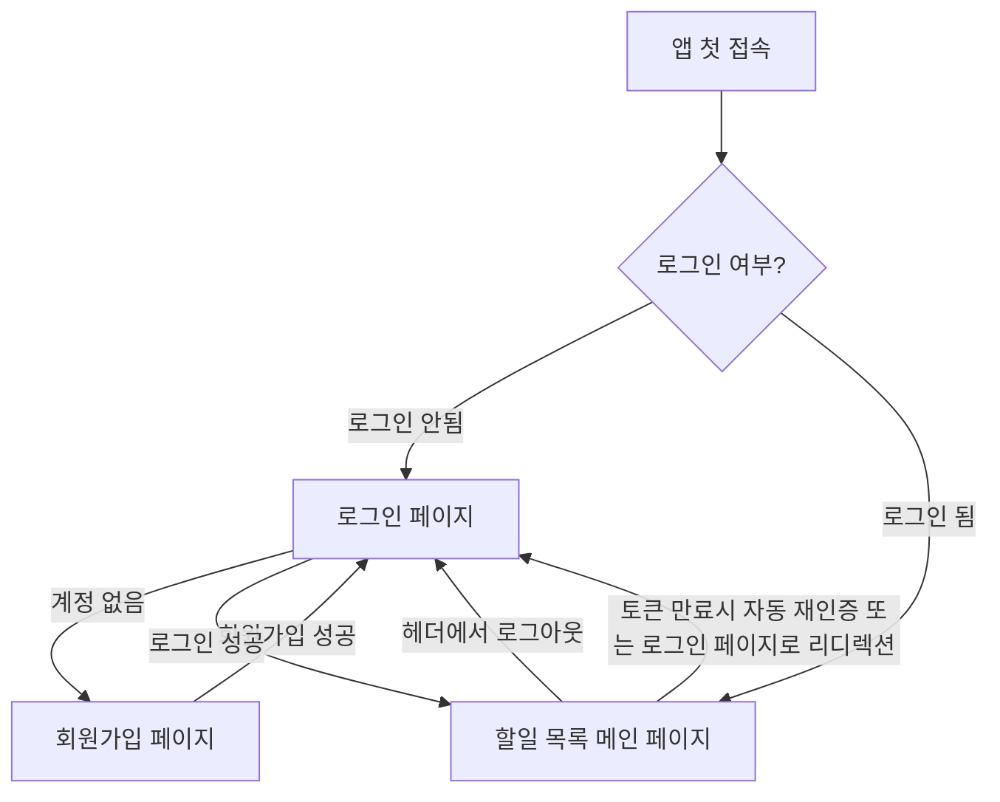
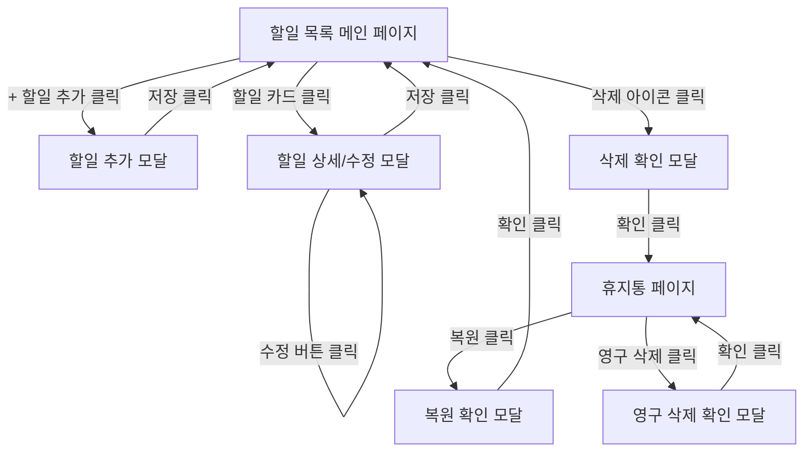

# csh-TodoList 와이어프레임 명세

**버전**: 1.0
**작성일**: 2025-11-26
**상태**: 초안
**작성자**: Claude (UI Designer, Project Manager)
**참조 문서**:
- [PRD](./3-prd.md)
- [사용자 시나리오](./4-user-scenarios.md)
- [데이터 모델 (ERD)](./6-erd.md)

---

## 목차

1.  [개요](#1-개요)
    1.1. [문서 목적](#11-문서-목적)
    1.2. [와이어프레임 원칙](#12-와이어프레임-원칙)
2.  [공통 UI 요소](#2-공통-ui-요소)
    2.1. [헤더 (Header)](#21-헤더-header)
    2.2. [내비게이션 (Navigation)](#22-내비게이션-navigation)
    2.3. [버튼 (Button)](#23-버튼-button)
    2.4. [입력 필드 (Input Field)](#24-입력-필드-input-field)
3.  [핵심 화면 와이어프레임](#3-핵심-화면-와이어프레임)
    3.1. [로그인 페이지](#31-로그인-페이지)
    3.2. [회원가입 페이지](#32-회원가입-페이지)
    3.3. [할일 목록 메인 페이지](#33-할일-목록-메인-페이지)
    3.4. [할일 추가/수정 모달](#34-할일-추가수정-모달)
    3.5. [휴지통 페이지](#35-휴지통-페이지)
    3.6. [프로필 페이지](#36-프로필-페이지)
    3.7. [관리자 국경일 관리 페이지](#37-관리자-국경일-관리-페이지)
4.  [주요 사용자 흐름 (User Flow)](#4-주요-사용자-흐름-user-flow)
    4.1. [인증 흐름](#41-인증-흐름)
    4.2. [할일 CRUD 흐름](#42-할일-crud-흐름)
5.  [반응형 디자인 고려사항](#5-반응형-디자인-고려사항)
    5.1. [데스크톱 (1024px 이상)](#51-데스크톱-1024px-이상)
    5.2. [모바일 (768px 미만)](#52-모바일-768px-미만)

---

## 1. 개요

### 1.1 문서 목적

본 문서는 `csh-TodoList` 애플리케이션의 핵심 화면에 대한 저수준(low-fidelity) 와이어프레임을 정의하여, 사용자 인터페이스의 구조, 콘텐츠 배치 및 기본적인 상호작용 흐름을 시각화합니다. 이를 통해 개발팀과 디자인팀 간의 공통 이해를 돕고, 기능 구현의 기초 자료로 활용합니다.

### 1.2 와이어프레임 원칙

-   **구조 및 배치 우선**: 시각적 디자인 요소(색상, 폰트, 이미지 등)보다는 콘텐츠의 계층 구조와 배치에 집중합니다.
-   **기능 명확성**: 각 UI 요소의 기능과 상호작용을 명확히 표현합니다.
-   **반응형 고려**: 데스크톱과 모바일 환경에서의 화면 변화를 함께 고려합니다.
-   **참조 기반**: PRD의 UI/UX 요구사항(10장), 사용자 시나리오(4장), ERD(6장)를 주요 참조 자료로 활용합니다.

---

## 2. 공통 UI 요소

### 2.1 헤더 (Header)
-   **구성**:
    *   좌측: 서비스 로고 (`csh-TodoList`)
    *   중앙: 현재 페이지/기능 제목 (`할일 목록`, `휴지통` 등)
    *   우측:
        *   **사용자 정보 드롭다운**: 사용자 이름/프로필 이미지, 하위에 `내 프로필`, `로그아웃` 메뉴
        *   (`P1 기능`) 다크 모드 토글 버튼
-   **반응형**: 모바일에서는 사용자 정보 드롭다운이 햄버거 메뉴 또는 별도 아이콘으로 대체될 수 있음.

### 2.2 내비게이션 (Navigation)
-   **구성**:
    *   **메인 내비게이션 (데스크톱)**: 헤더 하단 또는 좌측 사이드바 형태로, 주요 페이지(`할일 목록`, `휴지통`, `국경일`, `프로필`, `관리자`) 링크
    *   **모바일 내비게이션**: 하단 고정 탭 바 또는 햄버거 메뉴 내 리스트
-   **메뉴 항목**: `할일 목록`, `휴지통`, `국경일`, `프로필`, `관리자` (관리자 역할일 때만 표시)

### 2.3 버튼 (Button)
-   **유형**:
    *   **Primary Button**: 주요 액션 (예: `로그인`, `회원가입`, `할일 추가`, `저장`)
    *   **Secondary Button**: 보조 액션 (예: `취소`, `복원`)
    *   **Icon Button**: 아이콘만으로 구성된 버튼 (예: `삭제`, `수정`, `추가(+)`)
-   **상태**: `Default`, `Hover`, `Active`, `Disabled`, `Loading`

### 2.4 입력 필드 (Input Field)
-   **유형**: `Text`, `Email`, `Password`, `Date`, `Textarea`
-   **구성**: `Label`, `Input Area`, `Placeholder`, `Help Text` (선택), `Error Message`
-   **상태**: `Default`, `Focused`, `Error`, `Disabled`
-   **검증**: 입력 시 또는 제출 시 유효성 검증 메시지 표시

---

## 3. 핵심 화면 와이어프레임

### 3.1. 로그인 페이지 (`/login`)

-   **설명**: 사용자가 애플리케이션에 접근하기 위해 인증 정보를 입력하는 화면.
-   **구성**:
    *   **중앙 정렬 컨테이너**:
        *   서비스 로고 (`csh-TodoList`)
        *   **로그인 폼**:
            *   `이메일` 입력 필드 (Label: `이메일`, Type: `email`, Placeholder: `이메일을 입력하세요`)
            *   `비밀번호` 입력 필드 (Label: `비밀번호`, Type: `password`, Placeholder: `비밀번호를 입력하세요`)
            *   `로그인` 버튼 (Primary)
        *   `비밀번호 찾기` 링크 (2차 개발 기능으로 현재는 제외)
        *   `계정이 없으신가요? 회원가입` 링크

#### 데스크톱 와이어프레임 (예시)

```
+------------------------------------+
| [로고]                             |
|                                    |
|              [csh-TodoList]        |
|                                    |
|          +---------------------+   |
|          |       로그인        |   |
|          +---------------------+   |
|          | 이메일:             |   |
|          | [-----------------] |   |
|          | 비밀번호:           |   |
|          | [-----------------] |   |
|          |                     |   |
|          | [    로그인 버튼    ] |   |
|          |                     |   |
|          | [비밀번호 찾기]     |   |
|          | [계정이 없으신가요? 회원가입] |
|          +---------------------+   |
|                                    |
+------------------------------------+
```

### 3.2. 회원가입 페이지 (`/register`)

-   **설명**: 신규 사용자가 계정을 생성하기 위한 정보를 입력하는 화면.
-   **구성**:
    *   **중앙 정렬 컨테이너**:
        *   서비스 로고 (`csh-TodoList`)
        *   **회원가입 폼**:
            *   `이메일` 입력 필드
            *   `비밀번호` 입력 필드
            *   `비밀번호 확인` 입력 필드
            *   `사용자 이름` 입력 필드 (Label: `사용자 이름`, Type: `text`, Placeholder: `이름을 입력하세요`)
            *   `회원가입` 버튼 (Primary)
        *   `이미 계정이 있으신가요? 로그인` 링크

### 3.3. 할일 목록 메인 페이지 (`/`)

-   **설명**: 로그인한 사용자가 자신의 할일 목록을 조회하고 관리하는 메인 화면.
-   **구성**:
    *   **헤더**: [공통 UI 요소 2.1 참조]
    *   **메인 영역**:
        *   **상단 컨트롤 바**:
            *   `검색` 입력 필드 (Placeholder: `할일 검색...`)
            *   `필터` 드롭다운 (예: `전체`, `활성`, `완료`, `만료 임박`)
            *   `정렬` 드롭다운 (예: `생성일 최신순`, `만료일 가까운순`)
            *   `+ 할일 추가` 버튼 (Primary)
        *   **할일 목록**:
            *   각 할일은 `TodoCard` 컴포넌트로 표시
            *   **`TodoCard` 구성**:
                *   체크박스 (완료/미완료 상태)
                *   제목 (필수, `PRD 8.2`의 `title`)
                *   내용 (선택, `PRD 8.2`의 `content`, 텍스트 일부만 표시)
                *   만료일 (필수, `PRD 8.2`의 `dueDate`, 만료 임박 시 시각적 강조)
                *   수정 아이콘 버튼
                *   삭제 아이콘 버튼
            *   **국경일 표시**: 할일 목록 내에 날짜별로 통합 표시될 수 있음 (`PRD 10.1`)
                *   `HolidayCard` 컴포넌트: 날짜, 국경일 이름 (예: `12월 25일 - 크리스마스 🎄`)
        *   **할일 없음 메시지**: 목록이 비어 있을 때 표시 (`할일이 없습니다. 새로 추가해보세요!`)

#### 데스크톱 와이어프레임 (예시)

```
+----------------------------------------------------------------------------------+
| [로고]                 할일 목록               [사용자 이름 ▼] [다크모드 토글] |
+----------------------------------------------------------------------------------+
|                                                                                  |
| [검색창                 ] [필터 ▼] [정렬 ▼]                           [+ 할일 추가] |
|                                                                                  |
| +------------------------------------------------------------------------------+ |
| | [ ] 할일 제목1                                            만료일: 2025-11-28 | |
| |     간단한 내용 미리보기...                                  [수정] [삭제] | |
| +------------------------------------------------------------------------------+ |
| | [ ] 할일 제목2 (만료 임박)                                만료일: 2025-11-27 | |
| |     중요한 내용입니다.                                       [수정] [삭제] | |
| +------------------------------------------------------------------------------+ |
| | 🎄 2025-12-25 크리스마스                                                      | |
| +------------------------------------------------------------------------------+ |
| | [x] 완료된 할일 제목3                                     만료일: 2025-11-20 | |
| |     완료된 내용은 취소선 처리                                [수정] [삭제] | |
| +------------------------------------------------------------------------------+ |
|                                                                                  |
+----------------------------------------------------------------------------------+
```

#### 모바일 와이어프레임 (예시)

```
+------------------------------------+
| [로고]         할일 목록           [☰] |
+------------------------------------+
| [검색창           ] [필터] [정렬]    |
|                                    |
| +--------------------------------+ |
| | [ ] 할일 제목1                 | |
| |     만료일: 2025-11-28         | |
| |     내용 미리보기              | |
| | [수정 아이콘] [삭제 아이콘]    | |
| +--------------------------------+ |
|                                    |
| +--------------------------------+ |
| | 🎄 2025-12-25 크리스마스       | |
| +--------------------------------+ |
|                                    |
| [        + 할일 추가 (Floating)        ] |
|                                    |
| +------------------------------------+
| | [홈]   [휴지통] [국경일] [프로필] |
+------------------------------------+
```

### 3.4. 할일 추가/수정 모달

-   **설명**: 할일을 새로 생성하거나 기존 할일의 상세 내용을 수정하는 모달 창.
-   **구성**:
    *   **모달 헤더**:
        *   제목 (`할일 추가` 또는 `할일 수정`)
        *   닫기 아이콘 버튼 (`X`)
    *   **모달 바디 (폼)**:
        *   `제목` 입력 필드 (Label: `제목`, Type: `text`, Placeholder: `할일 제목을 입력하세요`)
        *   `내용` 입력 필드 (Label: `내용`, Type: `textarea`, Placeholder: `상세 내용을 입력하세요`)
        *   `시작일` 입력 필드 (Label: `시작일`, Type: `date`)
        *   `만료일` 입력 필드 (Label: `만료일`, Type: `date`)
        *   (`수정 모드에서만`) `완료 여부` 체크박스 (`isCompleted` 반영)
    *   **모달 푸터**:
        *   `취소` 버튼 (Secondary)
        *   `저장` 버튼 (Primary)
-   **상호작용**: `PRD 5.1.2`, `사용자 시나리오 3.2.1, 3.2.2` 참조.
    *   시작일/만료일 입력 시 달력 피커 표시
    *   만료일이 시작일보다 이전일 경우 에러 메시지 표시 (`PRD 12.6`)

### 3.5. 휴지통 페이지 (`/trash`)

-   **설명**: 소프트 삭제된 할일들을 모아 보여주고, 복원 또는 영구 삭제할 수 있는 화면.
-   **구성**:
    *   **헤더**: [공통 UI 요소 2.1 참조], 제목은 `휴지통`
    *   **메인 영역**:
        *   **설명 텍스트**: `삭제된 할일은 이곳에 보관됩니다. 영구 삭제 시 복구할 수 없습니다.`
        *   **휴지통 목록**:
            *   각 항목은 `TodoCard`와 유사하게 표시
            *   `TodoCard` 구성: 제목, 삭제일시 (`deletedAt`), `복원` 버튼 (Secondary), `영구 삭제` 버튼 (Danger)
        *   **휴지통 비어있음 메시지**: 목록이 비어 있을 때 표시 (`휴지통이 비어있습니다.`)
-   **상호작용**: `사용자 시나리오 2.1.3, 3.3.1` 참조.
    *   '복원' 버튼 클릭 시 할일 목록으로 복구 및 상태 변경
    *   '영구 삭제' 버튼 클릭 시 경고 모달 표시 후 완전 삭제

### 3.6. 프로필 페이지 (`/profile`)

-   **설명**: 현재 로그인한 사용자의 정보를 조회하고 수정할 수 있는 화면. (P1 우선순위)
-   **구성**:
    *   **헤더**: [공통 UI 요소 2.1 참조], 제목은 `내 프로필`
    *   **메인 영역**:
        *   **사용자 정보 표시**:
            *   `이메일`: (읽기 전용 텍스트)
            *   `사용자 이름`: 입력 필드 (Label: `이름`, Type: `text`, 현재 사용자 이름으로 채워짐)
            *   `새 비밀번호`: 입력 필드 (Label: `새 비밀번호`, Type: `password`)
            *   `새 비밀번호 확인`: 입력 필드 (Label: `새 비밀번호 확인`, Type: `password`)
        *   `정보 수정` 버튼 (Primary)
        *   `비밀번호 변경` 버튼 (Primary, 새 비밀번호 입력 시 활성화)
-   **상호작용**: `PRD 5.1.1` 참조.
    *   사용자 이름만 변경하거나, 비밀번호만 변경하거나, 둘 다 변경 가능

### 3.7. 관리자 국경일 관리 페이지 (`/admin/holidays`)

-   **설명**: 관리자(`role='admin'`)만 접근하여 국경일을 추가, 수정할 수 있는 화면. (P1 우선순위)
-   **구성**:
    *   **헤더**: [공통 UI 요소 2.1 참조], 제목은 `국경일 관리`
    *   **메인 영역**:
        *   **상단 컨트롤**:
            *   `+ 국경일 추가` 버튼 (Primary)
        *   **국경일 목록 테이블**:
            *   `제목`, `날짜`, `반복 여부`, `설명` 컬럼
            *   각 행마다 `수정` 아이콘 버튼 (삭제 불가 - `PRD 5.1.4`)
        *   **국경일 추가/수정 모달**:
            *   `제목` 입력 필드
            *   `날짜` 입력 필드
            *   `설명` 입력 필드
            *   `매년 반복` 체크박스
            *   `취소`, `저장` 버튼
-   **상호작용**: `사용자 시나리오 3.4.2` 참조.
    *   '추가' 버튼 클릭 시 빈 모달 표시
    *   '수정' 버튼 클릭 시 해당 국경일 정보로 모달 채워짐

---

## 4. 주요 사용자 흐름 (User Flow)

### 4.1. 인증 흐름 (회원가입 -> 로그인 -> 할일 목록)



### 4.2. 할일 CRUD 흐름 (목록 -> 추가/수정 -> 삭제/복원)



---

## 5. 반응형 디자인 고려사항

### 5.1. 데스크톱 (1024px 이상)

-   **레이아웃**: 좌측에 고정된 사이드바 내비게이션 + 우측에 메인 콘텐츠 영역 (또는 헤더 하단에 전체 너비 내비게이션).
-   **콘텐츠**: 넓은 공간을 활용하여 정보 밀도를 높이고, 여러 개의 컬럼 레이아웃을 사용 가능.
-   **컨트롤**: 모든 필터, 정렬, 검색 옵션이 항상 표시.
-   **모달**: 중앙에 크게 표시.

### 5.2. 모바일 (768px 미만)

-   **레이아웃**: 헤더 + 메인 콘텐츠 + 하단 고정 내비게이션 바. 사이드바는 햄버거 메뉴 또는 숨겨진 형태로 제공.
-   **콘텐츠**: 단일 컬럼 레이아웃으로 변경. `TodoCard`는 더 크고 터치하기 쉽게.
-   **컨트롤**: 필터, 정렬, 검색은 컴팩트한 형태로 변경되거나, 별도 모달/페이지로 이동될 수 있음. 검색창은 확장형으로 제공.
-   **모달**: 전체 화면을 차지하는 `풀스크린 모달` 형태로 제공.
-   **상호작용**: 터치 중심의 제스처(예: 스와이프하여 삭제 - P1) 고려.
-   **Floating Action Button (FAB)**: 할일 추가 버튼은 화면 하단에 플로팅 버튼으로 고정될 수 있음 (`사용자 시나리오 2.2.2`).
